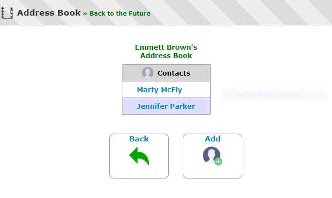

# address-book

Address Book frontend application and backend service, developed with Python, SQLAlchemy and Flask

## Frontend application
- Path
    - http://{host}/addressBooks/

- Screenshot
    

## API endpoints

- AddressBookService
    - http://{host}:{port}/api/addressBooks/
    - http://{host}:{port}/api/addressBooks/{id}

- ContactService
    - http://{host}:{port}/api/addressBooks/{id}/contacts/
    - http://{host}:{port}/api/addressBooks/{id}/contacts/{id}
    - http://{host}:{port}/api/addressBooks/{id}/contacts/{id}/name/{name}
    - http://{host}:{port}/api/addressBooks/{id}/contacts/{id}/birthday/year/{year}
    - http://{host}:{port}/api/addressBooks/{id}/contacts/{id}/birthday/month/{month}
    - http://{host}:{port}/api/addressBooks/{id}/contacts/{id}/birthday/day/{day}

## ORM diagram

